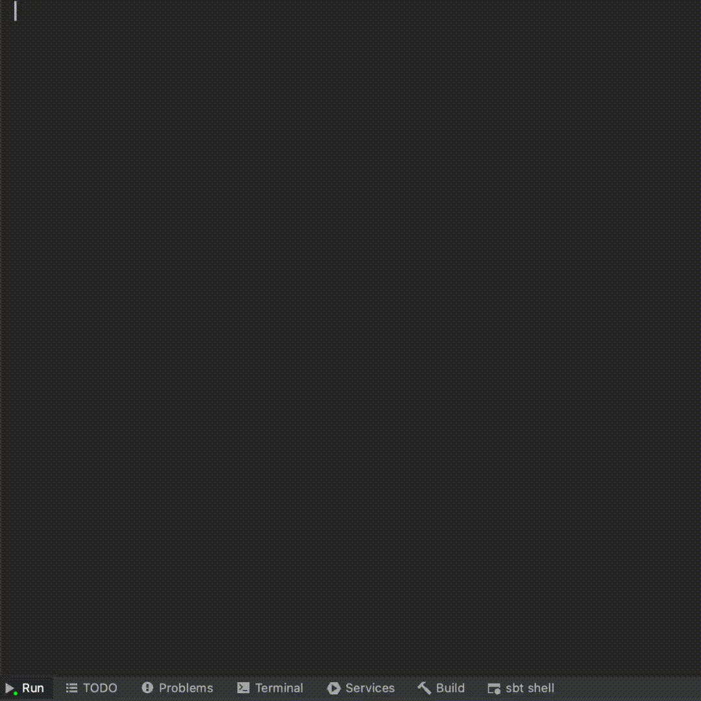

# hit-and-blow

<!-- *Hit and Blow* is a game of Clubhouse Games: 51 Worldwide Classics. -->
Switch游戏 - 猜颜色 自动解算器。

猜颜色是《世界游戏大全51》中的一款小游戏。本项目复现了该游戏的基本玩法，并具备“自动解算”功能。

游戏的命令行实现：



## Functions

已支持：

- 游戏模式 (`game.py`)：复现基本功能，可在命令行体验游戏玩法
- 自动解算 (`auto_play.py`)：计算答案的可行域，使用寻优策略逐步逼近答案
- 实验模式 (`experiment.py`)：多次重复自动解算过程，用于统计寻优策略的性能指标
- 作弊模式 (`hacker.py`)：和朋友联机时，快人一步得出答案 ( `д´)

## Usage

以作弊模式为例：

1. 在项目根目录下，新建 `hack.py`
2. 将以下代码贴入文件中保存
3. 在命令行中，执行 `python hack.py`

```python
# hack.py
import switch_hacker
hk = switch_hacker.hacker.Hacker()
hk.main()
```

## Tree

文件树

```
├── README.md
├── example.py: 示例代码
└── switch_hacker
    ├── __init__.py
    ├── base.py: 通用函数集合
    ├── game.py: 命令行游戏
    ├── auto_play.py: 自动解算器
    ├── experiment.py: 实验统计模块
    ├── hacker.py: 作弊模块
    └── strategy.py: 寻优策略
```

## Log

- [x] 命令行游戏
- [x] 自动解算器
- [x] 实验统计模块
- [x] 作弊模块
- [ ] 强化学习
